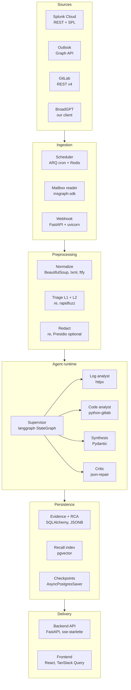
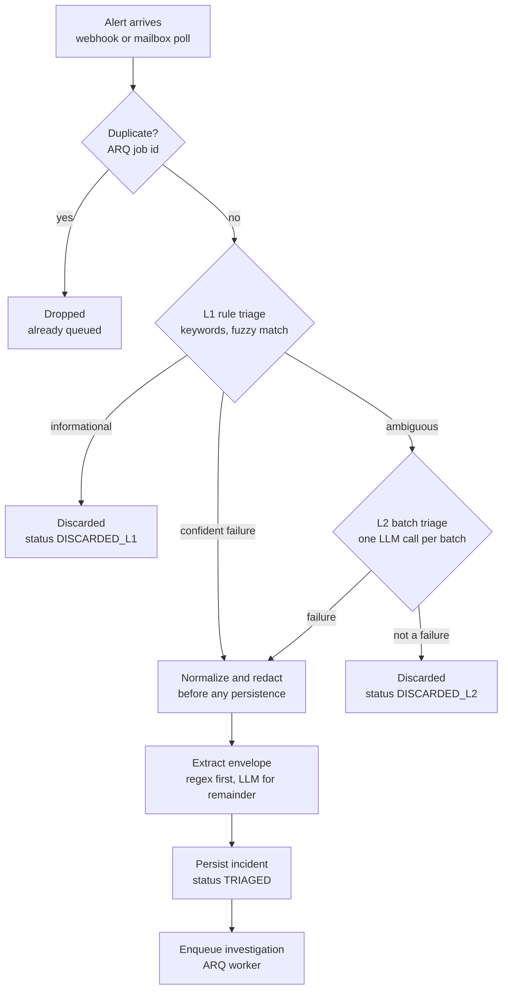
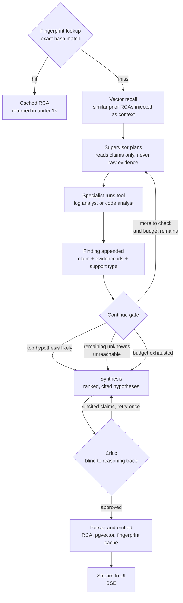
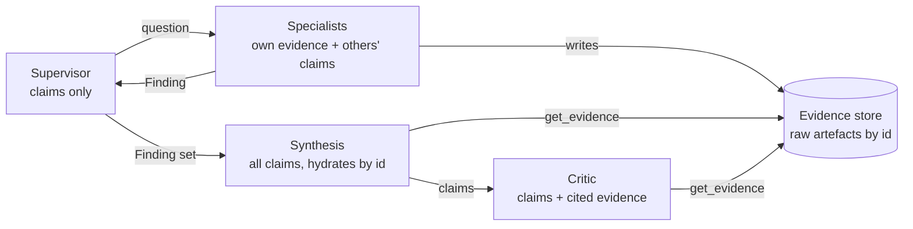
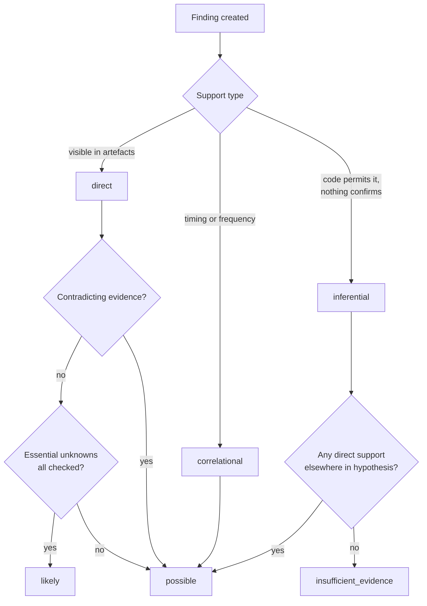
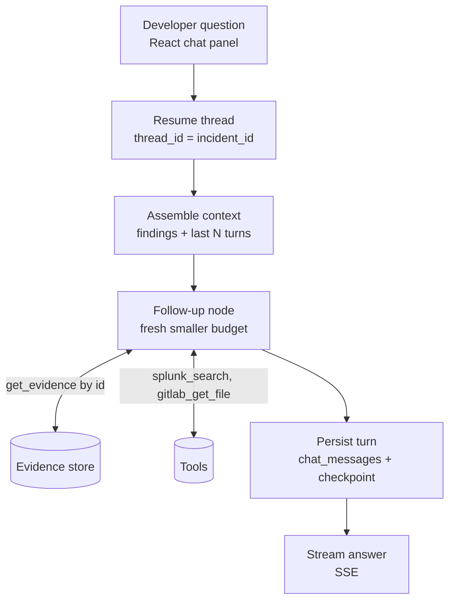
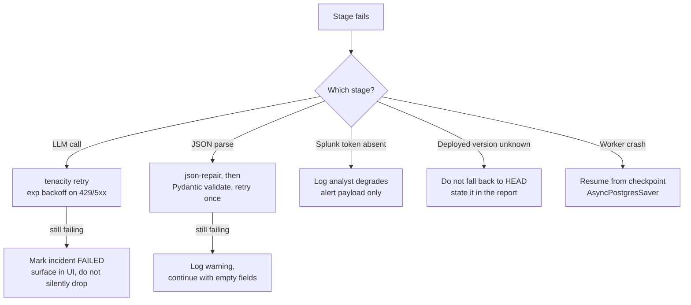

# RCA Agent — Application Logic Flow

**Date:** 2026-09-10
**Companion to:** `docs/superpowers/specs/2026-09-10-rca-agent-poc-design.md`

Diagrams are Mermaid, so they render in GitLab, VS Code, and most wikis.

---

## 1. System layers

Colour of intent, if you redraw this: everything in Ingestion, Preprocessing and
Persistence is deterministic Python you can unit-test. Only the Agent runtime calls an
LLM. That ratio is deliberate — the parts that can be wrong in interesting ways are
few and clearly bounded.

---

## 2. Intake and triage

### Why the order is what it is

**L1 has three outcomes, not two.** Informational dies immediately. A confident failure
— an obvious stack trace in the subject — skips L2 entirely. Only genuinely ambiguous
subjects reach the LLM. This means the model is consulted for a minority of a minority,
and most alert mail costs nothing at all.

**L2 is batched, not per-message.** Subjects are accumulated and classified in one call
returning a JSON array indexed back to inputs. Forty subjects cost one request.

**Redaction happens after triage, before everything else.** Triage reads only subject
lines, which rarely carry identifiers, so discarded mail never pays redaction cost. The
body is redacted the instant it is touched — before the database, before extraction.
Two tests enforce this and must never be deleted.

**Extraction is deterministic first.** Timestamps via dateutil, hostnames and
environment via regex. Only residual free text reaches the LLM. A regex cannot
hallucinate a server name.

**Idempotency is the ARQ job id.** The Splunk `sid` becomes the job id, so a webhook
retry is refused rather than starting a second investigation.

---

## 3. Investigation loop

### The two loops are capped differently

The **supervisor loop** is the expensive one. Typically three or four passes. Hard caps
on specialist invocations, tool calls, tokens, and wall clock — all held in graph state
and checked on the conditional edge.

The **critic loop** retries once. If the second attempt still contains uncited claims,
those claims are stripped rather than looping again.

### The continue gate has three exits

1. **Top hypothesis reaches `likely`** — the expected path.
2. **Every remaining unknown is unreachable** — if the only way forward is DB state or
   deploy history we cannot see, looping again produces more confident prose over
   identical evidence. Stop and say so.
3. **Budget exhausted** — produces a partial report naming what was missing. This is
   not an error state.

Exits 2 and 3 still produce a report. `insufficient_evidence` is a legitimate terminal
state.

### Fingerprint and vector recall do different jobs

A **fingerprint hit** short-circuits everything: same exception class, same top stack
frames, return the prior RCA. Most alerts are recurrences, so this is the common path
and it costs nothing.

A **similarity hit** does not short-circuit. It is injected as prior context so the
supervisor begins from "something like this was a connection pool problem last quarter"
rather than from zero.

### Context transfer rule

Agents never pass transcripts, and raw evidence never travels between them.

A `Finding` is `id, agent, claim, evidence_ids[], support_type, confidence`. The claim
is one sentence; everything backing it is a reference. The supervisor's context stays
near-constant regardless of incident size, which is what keeps its planning coherent on
the sixth hop.

Log volume is reduced deterministically before any agent sees it: Python aggregates
occurrence counts, time buckets, and distinct message templates, then passes at most K
representative samples. This single decision is the difference between an incident
costing cents and costing dollars.

---

## 4. Confidence derivation

Confidence is computed in Python from evidence shape. It is never self-reported by the
model, because self-reported confidence tracks prompt phrasing rather than evidence
quality.

Reported bands are `likely`, `possible`, `insufficient_evidence`. No percentages — they
imply a precision we cannot back, and developers correctly distrust them.

**Unknowns register.** Every hypothesis declares what would confirm or refute it.
Anything the system cannot see is recorded rather than glossed. Given current access, a
hypothesis hinging on DB state or a recent deploy is capped at `possible` by
construction. That register is also the concrete business case for phase-2 access.

---

## 5. Follow-up chat

**What assemble-context does not do** is replay the investigation transcript. It sends
the findings ledger, the last few chat turns, and nothing else. Evidence arrives only
when the model asks for a specific ID. Without this rule the third follow-up on a large
incident drags 80k tokens of log context and answers visibly degrade.

**Graph state and chat history are separate tables on purpose.** Graph state holds
findings, evidence references, budgets, and the unknowns register. `chat_messages`
holds the developer's turns. Conflating them reintroduces exactly the context bloat the
findings model exists to prevent.

The follow-up node holds the same tools the specialists had, under its own smaller
budget, so "did this also happen in UAT?" triggers a real search rather than a guess
from memory.

**Open product decision:** whether follow-up chat is available while an investigation is
still running. Allowing it mid-flight is nicer for users and meaningfully more complex —
two writers on one thread. Recommendation for the POC is post-completion only.

---

## 6. Error and degradation paths

Two of these are correctness rules rather than resilience:

**Never fall back to repository HEAD.** Production runs a build from weeks ago. Reading
HEAD produces a confident, fluent, wrong explanation of code that is not running — worse
than producing nothing. If the deployed version cannot be determined, say so.

**Never silently drop a failed incident.** A developer who receives a Splunk alert and
finds nothing in the UI will stop trusting the UI. Failed incidents appear with their
failure reason.

---

## 7. Known limitations, by design

| Limitation | Consequence | Removed by |
|---|---|---|
| No deploy or CI history | Cannot attribute a failure to a release | Jenkins/Harness read access |
| No database access | Cannot separate bad data from bad code | Read replica or DBA query API |
| Splunk REST token pending | Log analyst cannot run follow-up searches | Token approval |
| Tool calling unconfirmed | May need textual ReAct fallback | BroadGPT team confirmation |
| One application, one repo | Stack-frame-to-file mapping is exact | Multi-repo needs a resolver, not embeddings |

These belong in the product UI, not only in this document. A system that names what it
cannot see earns more trust than one that guesses.
